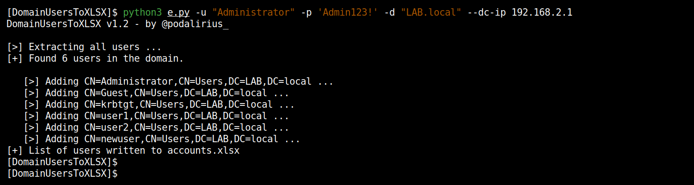

# DomainUsersToXLSX

<p align="center">
  This Python script can be used to bypass IP source restrictions using HTTP headers.
  <br>
  
  
  <a href="https://twitter.com/intent/follow?screen_name=podalirius_" title="Follow"></a>
  <br>
</p>

## Features

 - [x] Extract all domain users to Excel worksheet

## Usage

```
$ ./ipsourcebypass.py -h
[~] IP source bypass using HTTP headers, v1.2

usage: ipsourcebypass.py [-h] [-v] -i IP [-t THREADS] [-x PROXY] [-k] [-L] [-j JSONFILE] [-C] [-H HEADERS] [-S] url

This Python script can be used to test for IP source bypass using HTTP headers

positional arguments:
  url                   e.g. https://example.com:port/path

optional arguments:
  -h, --help            show this help message and exit
  -v, --verbose         arg1 help message
  -i IP, --ip IP        IP to spoof.
  -t THREADS, --threads THREADS
                        Number of threads (default: 5)
  -x PROXY, --proxy PROXY
                        Specify a proxy to use for requests (e.g., http://localhost:8080)
  -k, --insecure        Allow insecure server connections when using SSL (default: False)
  -L, --location        Follow redirects (default: False)
  -j JSONFILE, --jsonfile JSONFILE
                        Save results to specified JSON file.
  -C, --curl            Generate curl commands for each request.
  -H HEADERS, --header HEADERS
                        arg1 help message
  -S, --save            Save all HTML responses.
```

## Demonstration




## Contributing

Pull requests are welcome. Feel free to open an issue if you want to add other features.
